# E-Commerce Platform Dependency Map

## System Architecture Overview


## Service Communication Matrix

```mermaid
graph LR
    subgraph "Synchronous Dependencies (HTTP/REST)"
        OS[Order Service] -->|User Validation<br/>GET /api/v1/users/{id}| US[User Service]
        OS -.->|Product Details<br/>GET /api/v1/products/{id}| PS[Product Service]
        OS -.->|Payment Processing<br/>POST /api/v1/payments| PayS[Payment Service]
    end
    
    subgraph "Asynchronous Dependencies (Events)"
        OS2[Order Service] -.->|OrderCreated| US2[User Service]
        PayS2[Payment Service] -.->|PaymentConfirmed| OS2
        US2 -.->|UserProfileUpdated| PS2[Product Service]
    end
    
    classDef implemented fill:#d4edda,stroke:#155724
    classDef missing fill:#f8d7da,stroke:#721c24
    
    class OS,OS2,US,US2 implemented
    class PS,PS2,PayS,PayS2 missing
```

## Database Relationship Diagram


## Infrastructure Dependencies


## Deployment Order and Critical Path

```mermaid
graph TB
    subgraph "Phase 1: Infrastructure"
        P1[PostgreSQL] --> P2[Redis]
        P2 --> P3[RabbitMQ]
        P3 --> P4[Kong Gateway]
    end
    
    subgraph "Phase 2: Core Services"
        P4 --> S1[User Service<br/>🟡 Needs Completion]
        P4 --> S2[Product Service<br/>🔴 Not Implemented]
    end
    
    subgraph "Phase 3: Business Services"
        S1 --> S3[Payment Service<br/>🔴 Not Implemented]
        S2 --> S3
        S3 --> S4[Order Service<br/>🟢 Ready]
    end
    
    subgraph "Critical Dependencies"
        CD1[Order Creation Blocked<br/>Without User Service API]
        CD2[Payment Processing Blocked<br/>Without Payment Service]
        CD3[Product Validation Blocked<br/>Without Product Service]
    end
    
    classDef ready fill:#d4edda,stroke:#155724
    classDef partial fill:#fff3cd,stroke:#856404
    classDef blocked fill:#f8d7da,stroke:#721c24
    classDef infra fill:#e2e3e5,stroke:#383d41
    
    class P1,P2,P3,P4 infra
    class S4 ready
    class S1 partial
    class S2,S3 blocked
    class CD1,CD2,CD3 blocked
```



## Legend

| Symbol | Meaning |
|--------|---------|
| 🟢 | Fully Implemented |
| 🟡 | Partially Implemented |
| 🔴 | Not Implemented |
| ──→ | Synchronous Dependency (HTTP/REST) |
| ╌╌→ | Asynchronous Dependency (Events) |
| ━━→ | Database Connection |
| - - → | Planned/Missing Dependency |

## Critical Findings

### Implementation Status
- **Order Service**: 95% complete, production-ready
- **User Service**: 20% complete, missing API layer
- **Product Service**: 0% implemented, blocks inventory management
- **Payment Service**: 0% implemented, blocks order completion

### Blocking Dependencies
1. **User validation** prevents order creation
2. **Product validation** prevents inventory checks  
3. **Payment processing** prevents order completion
4. **Event system** prevents async communication

### Recommended Implementation Priority
1. Complete User Service API endpoints
2. Implement basic Product Service
3. Add Payment Service integration
4. Implement event-driven communication patterns
5. Add circuit breaker and resilience patterns