# E-Commerce Platform Dependency Diagram

## Service Architecture Overview

```mermaid
graph TB
    %% External Clients
    Client[External Clients<br/>Web/Mobile]
    
    %% API Gateway
    Kong[Kong API Gateway<br/>Port 8000/8001<br/>🔒 JWT Auth, Rate Limiting]
    
    %% Services
    UserSvc[User Service<br/>🚧 20% Complete<br/>Port 8080]
    OrderSvc[Order Service<br/>✅ 95% Complete<br/>Port 8080]
    ProductSvc[Product Service<br/>❌ Not Implemented<br/>Port 8080]
    PaymentSvc[Payment Service<br/>❌ Not Implemented<br/>Port 8080]
    
    %% Infrastructure
    Postgres[(PostgreSQL 15<br/>Port 5432<br/>🔴 Critical)]
    Redis[(Redis 7<br/>Port 6379<br/>🟡 High)]
    RabbitMQ[(RabbitMQ 3<br/>Port 5672/15672<br/>🟡 High)]
    
    %% Client to API Gateway
    Client -->|HTTPS| Kong
    
    %% API Gateway to Services
    Kong -->|HTTP| UserSvc
    Kong -->|HTTP| OrderSvc  
    Kong -->|HTTP| ProductSvc
    Kong -->|HTTP| PaymentSvc
    
    %% Synchronous Service Communication (Current)
    OrderSvc -->|GET /users/{id}<br/>🔴 Critical Sync| UserSvc
    
    %% Planned Synchronous Communication
    OrderSvc -.->|GET /products/{id}<br/>🔴 Critical Sync<br/>📋 Planned| ProductSvc
    OrderSvc -.->|POST /payments<br/>🔴 Critical Sync<br/>📋 Planned| PaymentSvc
    
    %% Database Connections
    UserSvc -->|JDBC<br/>user_service_dev| Postgres
    OrderSvc -->|JDBC<br/>orderdb| Postgres
    ProductSvc -.->|JDBC<br/>📋 Planned| Postgres
    PaymentSvc -.->|JDBC<br/>📋 Planned| Postgres
    
    %% Redis Connections
    UserSvc -.->|Session Storage<br/>📋 Planned| Redis
    OrderSvc -.->|Caching<br/>📋 Planned| Redis
    
    %% RabbitMQ Event Flows (Planned)
    UserSvc -.->|UserProfileUpdated<br/>📋 Async Event| RabbitMQ
    PaymentSvc -.->|PaymentConfirmed<br/>📋 Async Event| RabbitMQ
    OrderSvc -.->|OrderCreated<br/>📋 Async Event| RabbitMQ
    
    RabbitMQ -.->|📋 Event Consumer| ProductSvc
    RabbitMQ -.->|📋 Event Consumer| OrderSvc
    RabbitMQ -.->|📋 Event Consumer| UserSvc
    
    %% Styling
    classDef implemented fill:#90EE90
    classDef partial fill:#FFE4B5  
    classDef notImplemented fill:#FFB6C1
    classDef critical fill:#FF6B6B
    classDef high fill:#FFD93D
    classDef infrastructure fill:#87CEEB
    
    class OrderSvc implemented
    class UserSvc partial
    class ProductSvc,PaymentSvc notImplemented
    class Kong,Postgres critical
    class Redis,RabbitMQ high
    class Kong,Postgres,Redis,RabbitMQ infrastructure
```

## Database Schema Relationships

```mermaid
erDiagram
    %% User Service Schema
    users {
        uuid id PK
        varchar email UK
        timestamp created_at
        timestamp updated_at
    }
    
    user_profiles {
        uuid user_id PK,FK
        varchar first_name
        varchar last_name
        varchar phone
    }
    
    %% Order Service Schema
    orders {
        uuid id PK
        uuid user_id FK "Logical FK to users.id"
        varchar status
        decimal total_amount
        timestamp created_at
        timestamp updated_at
    }
    
    order_items {
        uuid id PK
        uuid order_id FK
        uuid product_id FK "Logical FK to products.id"
        integer quantity
        decimal unit_price
    }
    
    %% Planned Product Service Schema
    products {
        uuid id PK "📋 Planned"
        varchar name "📋 Planned"
        decimal price "📋 Planned"
        integer inventory "📋 Planned"
    }
    
    %% Planned Payment Service Schema  
    payments {
        uuid id PK "📋 Planned"
        uuid order_id FK "📋 Planned"
        decimal amount "📋 Planned"
        varchar status "📋 Planned"
    }
    
    %% Physical Relationships (Same Service)
    users ||--|| user_profiles : "has profile"
    orders ||--o{ order_items : "contains items"
    
    %% Logical Relationships (Cross-Service)
    users ||--o{ orders : "places orders (logical)"
    products ||--o{ order_items : "ordered as (logical, planned)"
    orders ||--|| payments : "payment for (logical, planned)"
```



## Communication Flow Diagram


## Criticality & Failure Impact Matrix

```mermaid
mindmap
  root((System Dependencies))
    Critical 🔴
      PostgreSQL
        Complete system failure
        All services down
      Kong Gateway
        No external access
        API unavailable
      User Validation
        Order creation blocked
        Business process halt
    High 🟡  
      Redis Cache
        Performance degradation
        Increased DB load
      RabbitMQ
        No async processing
        Event loss risk
    Medium 🟠
      Monitoring
        Reduced visibility
        Debugging difficulty
      Logging
        Audit trail loss
        Troubleshooting impact
```



## Implementation Roadmap


## Key Findings Summary

### 🔴 Critical Issues
1. **Missing Services**: Product and Payment services block core functionality
2. **Single Points of Failure**: No circuit breakers or fallback strategies
3. **Infrastructure Dependencies**: PostgreSQL failure = complete outage

### 🟡 High Priority Improvements
1. **Resilience Patterns**: Implement circuit breakers, retries, timeouts  
2. **Caching Strategy**: Redis integration for performance optimization
3. **Event-Driven Architecture**: RabbitMQ integration for loose coupling

### 🟢 Implementation Strengths
1. **Clean Architecture**: Well-defined service boundaries
2. **Database Design**: Proper normalization and indexing
3. **API Gateway**: Security and routing infrastructure in place

### 📋 Next Steps
1. Complete Product Service implementation
2. Complete Payment Service implementation  
3. Implement circuit breaker patterns
4. Add comprehensive monitoring and alerting
5. Implement event-driven communication patterns

---

*Generated by Claude Code Dependency Mapping Tool - 2025-08-10*