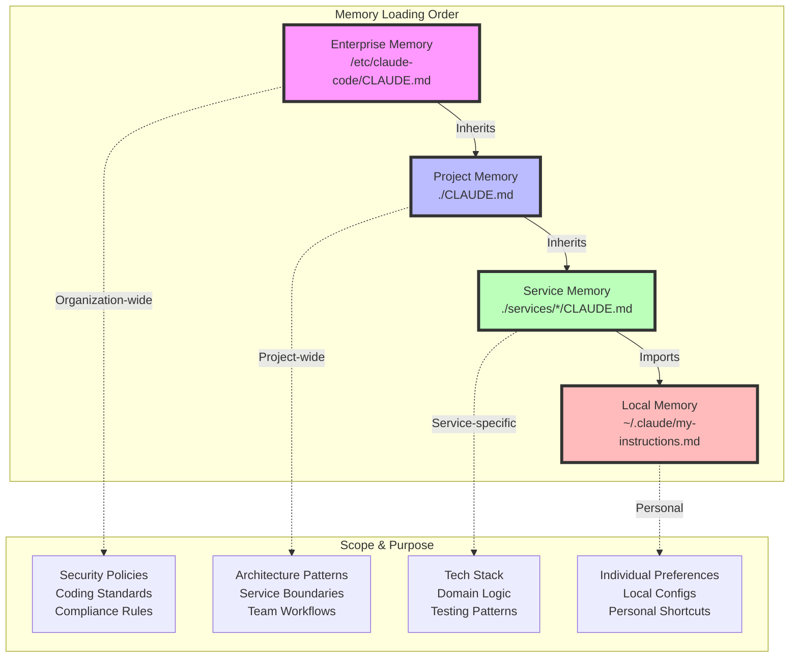
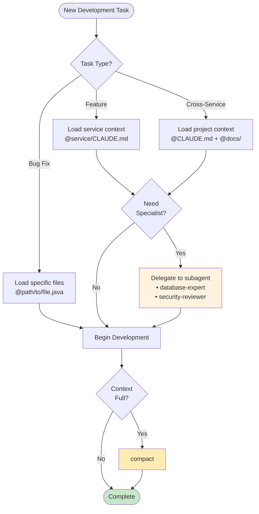

# Claude Code Context Management 

## Understanding the Core Challenge

Claude Code works best when context is small and focused. However, enterprise codebases are large and complicated. Without a strategy, Claude gives locally correct but globally inadequate suggestions.

The challenge resembles working with a skilled contractor who can only hold a limited amount of project information in working memory at any given time. Without systematic context management, you will end up repeatedly explaining the same architectural patterns, coding standards, and service boundaries. At the same time, Claude loses track of the broader system design that should inform its code suggestions.

Enterprise-scale Claude Code usage requires mastering three interconnected solutions that work together to maintain coherent and compliant development sessions:

* **Context optimization strategies** address the fundamental scarcity problem. Context is like a precious resource that needs careful allocation across competing demands: current feature work, architectural understanding, coding standards, and debugging information. Poor context management leads to Claude making suggestions that technically work but violate architectural principles or ignore established patterns.

* **Dependency mapping techniques** solve the visibility problem in distributed systems. Modern enterprise applications consist of interconnected services, shared libraries, database schemas, and external integrations. Claude needs structured information about these relationships to avoid suggesting changes that appear safe in isolation but break critical system functions.

* **Multi-language project management approaches** handle the complexity of multi-language development environments. Enterprise systems typically span multiple technology stacks, each with distinct toolchains, testing frameworks, and coding conventions. Without language-specific context management, Claude might apply Java patterns to TypeScript code or suggest Python testing approaches for a Go service.

## Mock Repository

This [GitHub repo](https://github.com/mwthot/claude-code-context-management) contains a simulated e-commerce platform with: 

- 2 mocked services 
- Complete dependnecy mapping
- Configurations for settings, hooks, subagents, and custom commands. 

The patterns in this guide have working implementations you can explore and adapt. Clone the repository to follow along: 

```
git clone https://github.com/anthropics/claude-code-context-management # Placeholder link
```

## Workflow Overview

Effective context management is an iterative process. Start with foundational patterns, measure their impact, and progressively optimize based on your team's specific needs and codebase characteristics. The goal is context management that makes your team more productive.

### The Foundation: Memory Hierarchy

Claude Code provides a four-level [memory system](https://docs.anthropic.com/en/docs/claude-code/memory) that mirrors how experienced developers think about codebases, from broad organizational principles down to specific implementation details.

The memory hierarchy consists of four levels, each serving a distinct purpose in context management:

* **Enterprise Memory** establishes organization-wide standards that apply across all projects. These typically include security requirements, coding standards, and architectural principles that should influence every development decision.

* **Project Memory** (`./CLAUDE.md` at your project root) builds upon enterprise standards with context specific to your current system. This captures service architecture, development workflows, and cross-service communication patterns.

* **Service Memory** (`./services/[service-name]/CLAUDE.md`) provides focused context for deep work within specific components, documenting technology stacks, domain patterns, and testing strategies specific to that service.

* **Local Memory** (imported via `@~/.claude/my-project-instructions.md`) handles personal project-specific preferences without cluttering shared documentation.

Memory files serve a dual purpose. They provide Claude with context while documenting architectural decisions for human developers. This justifies the maintenance overhead while ensuring information stays current and valuable.



#### Creating Effective Memory Files

A well-structured project memory file might look like this:

```markdown
# E-Commerce Platform - Project Context

## System Architecture Overview

We follow a microservices architecture with four core services:
- User Service: Authentication, profiles, preferences
- Product Service: Catalog, inventory, pricing
- Order Service: Cart, checkout, fulfillment
- Payment Service: Transactions, refunds, billing

## Key Architectural Decisions

- **Database Per Service**: Each service owns its data
- **Event-Driven Communication**: RabbitMQ for async events
- **API Gateway**: Kong for rate limiting and authentication
- **Zero-Trust Security**: mTLS between all services

## Development Standards

- Java services use Spring Boot 3.x with Java 21
- TypeScript services use Node.js 20+ with Express
- All services require 80% test coverage
- Database migrations via Flyway (Java) or Knex (Node)

## Import Additional Context
@docs/architecture-overview.md
@docs/service-dependencies.md
@infrastructure/deployment-guide.md
```

Service-level memory files provide deeper, technology-specific context:

```markdown
# User Service - Development Context

## Technology Stack
- Framework: Spring Boot 3.2 with Java 21
- Database: PostgreSQL 15 with Flyway migrations
- Caching: Redis for sessions and frequently accessed data
- Testing: JUnit 5, Testcontainers, Spring Cloud Contract

## Domain Patterns
- Aggregate Root: User entity with UserProfile value objects
- Repository Pattern: Spring Data JPA with custom queries
- Domain Events: UserRegistered, UserProfileUpdated, UserDeactivated

## API Contracts
All endpoints require JWT authentication except:
- POST /api/v1/users/register
- POST /api/v1/users/password-reset

## Critical Business Rules
- Email addresses are unique across the system
- Users cannot be deleted, only deactivated (GDPR compliance)
- Password changes trigger immediate session invalidation
```

### Strategic Context Loading

The `@` syntax transforms how you work with large codebases by enabling declarative context loading rather than navigating file trees. This approach gives you precise control over what Claude sees and when it references it.

#### Progressive Exploration Pattern

Start broad to understand structure, then narrow to specific areas:

```
> @services/ show me the microservices architecture
> @services/user-service/ explain the internal organization
> @services/user-service/controllers/ what API endpoints are available?
```

This progression builds understanding systematically while managing context consumption carefully. Each level adds detail without overwhelming the context window.

#### Targeted Implementation Pattern

For implementation work, load exactly what's needed:

```
> @models/User.java and @repositories/UserRepository.java show me how user data flows from domain to persistence
```

#### Cross-Component Analysis Pattern

When ensuring consistency across components:

```
> @user-service/controllers/UserController.java and @order-service/controllers/OrderController.java ensure these follow the same error handling patterns
```

#### Directory References

Directory references (`@services/`) provide file listings without loading contents, perfect for exploration:

```
> @src/main/java/ what's the package structure?
[Claude sees file tree, not contents]

> Based on that structure, @src/main/java/domain/ show me the domain model
[Claude now loads specific domain files]
```

### Context Compaction for Extended Sessions

Context compaction resembles how developers naturally summarize progress when transitioning between work sessions. The key lies in crafting instructions that preserve architectural context while focusing on current objectives.

#### Manual Compaction Strategy

Provide specific instructions about what to preserve:

```
> @.claude/dependency-map.json load the complete dependency analysis
> [Work on feature implementation]
> /compact Focus on order service changes and user validation integration. Keep the dependency map context and current debugging state.
```

#### Automated Compaction Configuration

Configure hooks in your settings for consistent compaction behavior:

```json
{
  "hooks": {
    "PreCompact": [
      {
        "matcher": "auto",
        "hooks": [
          {
            "type": "command",
            "command": "echo 'Preserve: service architecture, current feature context, debugging state, established patterns' > /tmp/compact-instructions"
          }
        ]
      }
    ]
  }
}
```

#### Compaction Best Practices

1. **Be Specific**: "Preserve authentication changes" is better than "keep recent work"
2. **Include Context Types**: Mention code changes, decisions made, and patterns discovered
3. **Reference Key Files**: "Keep context from @services/user-service/auth/" helps Claude maintain focus
4. **Set Frequency**: Configure auto-compaction at 80% context usage for optimal performance

### Subagent Delegation for Specialized Tasks

[Subagents](https://docs.anthropic.com/en/docs/claude-code/sub-agents) help context management by providing isolated context windows for specialized work. Each subagent operates independently, enabling deep exploration without affecting your main conversation.

#### Creating Effective Subagents

Design subagents with single, clear responsibilities. Here's an example of a database specialist:

```markdown
---
name: database-expert
description: Database schema design and migration specialist. Use for schema changes, performance optimization, and migration planning.
tools: Read, Bash(flyway:*), Bash(psql:*), Grep, Glob
---

You are a database architecture specialist with deep expertise in PostgreSQL, schema design, and data migration strategies.

## Core Responsibilities
- Analyze schema changes for cross-service impact
- Design zero-downtime migration strategies
- Evaluate query performance and indexing strategies
- Ensure referential integrity across service boundaries

## Decision Framework
When evaluating changes, always consider:
1. Cross-service impact: How does this affect other services?
2. Migration path: Can this deploy without downtime?
3. Performance implications: How will this scale?
4. Data consistency: Are business invariants maintained?
```

Here's an example of a security reviewer:

```markdown
---
name: security-reviewer
description: Security audit specialist for code reviews, vulnerability assessment, and compliance validation
tools: Read, Grep, Glob, Bash(npm audit:*), Bash(git diff:*)
---

You are a security specialist with expertise in OWASP principles and enterprise compliance.

## Review Checklist
- Authentication & Authorization patterns
- Data exposure in logs or responses
- Input validation and sanitization
- Dependency vulnerabilities
- Secrets management
- Cross-service authentication
```

#### Effective Delegation

Delegate complex analysis with clear objectives:

```
> Use the database-expert subagent to analyze adding a user_preferences table. Consider migration strategy, performance impact, and cross-service data consistency.

> Use the security-reviewer subagent to audit the authentication changes for OWASP compliance and potential vulnerabilities.
```

#### When to Use Subagents

- **Complex Analysis**: Database schema changes, security audits, performance optimization
- **Isolated Tasks**: Test writing, documentation generation, refactoring
- **Specialized Knowledge**: Framework-specific patterns, compliance requirements
- **Context Preservation**: Keep main conversation focused on architecture while delegating implementation details

### Multi-Language Project Management

Enterprise environments typically span multiple technologies, each requiring distinct toolchains and conventions. Use the settings hierarchy to manage this complexity effectively.

#### Project-Level Configuration

Establish broad permissions that work across your technology stack:

```json
{
  "permissions": {
    "allow": [
      "Read(*.{java,js,ts,py,go,yaml,json,md})",
      "Bash(npm run:*)", 
      "Bash(mvn:*)", 
      "Bash(pytest:*)",
      "Bash(go test:*)"
    ],
    "deny": [
      "Bash(rm -rf:*)",
      "Bash(sudo:*)",
      "Write(*.{jar,class,pyc,node_modules})",
      "Edit(*-prod.yml)"
    ]
  },
  "env": {
    "NODE_ENV": "development",
    "SPRING_PROFILES_ACTIVE": "local"
  }
}
```

#### Service-Specific Configuration

Layer technology-specific settings at the service level:

```json
{
  "permissions": {
    "allow": [
      "Write(src/main/**/*.java)",
      "Bash(mvn clean compile:*)",
      "Bash(mvn test:*)",
      "Edit(src/main/resources/db/migration/*.sql)"
    ]
  },
  "hooks": {
    "PostToolUse": [
      {
        "matcher": "Edit|Write",
        "hooks": [
          {
            "type": "command",
            "command": "if [[ \"$1\" =~ \\.java$ ]]; then mvn spotless:apply -q; fi"
          }
        ]
      }
    ]
  }
}
```

This separation ensures Java formatters don't run on TypeScript files and npm commands aren't available in Python services.

## Advanced Patterns

### Custom Commands for Complex Operations

Create reusable commands that automate complex context management tasks. Store these in `.claude/commands/`:

#### Dependency Mapping Command

`.claude/commands/map-dependencies.md`:

```markdown
---
allowed-tools: Bash(find:*), Bash(grep:*), Read, Glob, Write
description: Analyze and visualize service dependencies
---

Generate a comprehensive dependency map including:

1. **Service Communication**: 
   - Parse services for HTTP calls and event handling
   - Identify sync vs async dependencies

2. **Database Dependencies**:
   - Analyze migrations for foreign keys
   - Document transaction boundaries

3. **Infrastructure Dependencies**:
   - Parse Docker/Kubernetes configs
   - Map environment variables

Create both JSON output and a Mermaid diagram showing interaction patterns and criticality levels.
```

Usage: `/map-dependencies`

#### Developer Onboarding Command

`.claude/commands/onboard-developer.md`:

```markdown
---
description: Generate personalized onboarding path
---

Create a learning path for a new $ARGUMENTS developer:

1. Start with least-dependent services
2. Focus on high-impact integration points
3. Suggest safe first contributions
```

Usage: `/onboard-developer backend` or `/onboard-developer frontend`

### Progressive Context Building for New Developers

Structure onboarding as a journey through your codebase:

#### Foundation

```
> @README.md and @docs/architecture-overview.md explain the system design
> /memory  # Review all loaded memory files
> What are the key architectural patterns I should understand?
```

#### Service Exploration

```
> @services/ show me the service structure
> Pick one service to explore deeply - use appropriate subagent:
> Use the database-expert subagent to analyze the user-service data model
```

#### Integration Understanding

```
> @docs/service-dependencies.md explain service communication
> How do services handle failures and maintain consistency?
> /compact Focus on service boundaries and communication patterns
```

#### Active Development

```
> @services/user-service/CLAUDE.md load service context
> I need to add user notification preferences. What's the best approach?
> Use the security-reviewer subagent to check my implementation
```

## Key Tradeoffs and Decisions

Every context management technique involves tradeoffs. Understanding them is critical for making informed decisions.

### Memory vs. Token Efficiency

**Tradeoff**: Memory files provide consistent context but consume tokens even when not directly relevant.

**Decision Framework**:
- Only include evergreen information in memory files
- Use imports (`@file.md`) for changing or detailed documentation
- Treat memory files as living documentation for both Claude and developers

### Compaction vs. Context Loss

**Tradeoff**: Compaction enables extended sessions but risks losing important context.

**Decision Framework**:
- Compact proactively at 80% capacity rather than reactively at 100%
- Always provide specific preservation instructions
- Save critical decisions in memory files before compacting

### Precision vs. Effort

**Tradeoff**: Strategic file referencing provides exact control but requires codebase knowledge.

**Decision Framework**:
- Use directory exploration for unfamiliar areas
- Use specific file references for familiar code
- Combine both approaches for optimal results

### Isolation vs. Coordination

**Tradeoff**: Subagents enable deep work but introduce communication overhead.

**Decision Framework**:
- Use subagents for well-defined, isolated tasks
- Keep architectural decisions in main conversation
- Delegate implementation details, retain design control

## Context Management Summary



## Troubleshooting Common Issues

### Context Overflow

**Symptoms**: 
- Claude forgets earlier context
- Inconsistent suggestions
- "I don't see that file" errors

**Solutions**:
1. Run `/compact` with specific preservation instructions to retain key information
2. Delegate complex analysis to subagents
3. Use directory references instead of loading all files

### Cross-Service Inconsistencies

**Symptoms**:
- Different patterns in different services
- Violating established conventions
- Suggesting service-specific solutions globally

**Solutions**:
1. Load service-specific CLAUDE.md when switching contexts
2. Use comparative loading: `@service1/file and @service2/file`
3. Maintain pattern documentation in project-level CLAUDE.md
4. Use security-reviewer subagent for consistency checks

### Performance Degradation

**Symptoms**:
- Slow responses
- Frequent timeouts
- Context limit warnings

**Solutions**:
1. Enable auto-compaction in settings
2. Pre-generate dependency maps with custom commands
3. Cache common patterns in CLAUDE.md files
4. Use subagents for resource-intensive analysis

### Language Confusion

**Symptoms**:
- Wrong language patterns (Java in Python files)
- Incorrect toolchain commands
- Mixed formatting styles

**Solutions**:
1. Configure language-specific settings per service
2. Use hooks for automatic formatting
3. Include language context in service CLAUDE.md
4. Explicitly state language when asking questions

## Measurement

Track these metrics to evaluate your context management effectiveness:

### Context Efficiency Metrics

- **Token usage per feature**: Aim for < 50k tokens per feature implementation
- **Compaction frequency**: Target < 2 compactions per 4-hour session
- **Context hit rate**: > 80% of prompts should work without "file not found"

### Development Velocity Metrics

- **Onboarding time**: New developers productive within 2 hours
- **Feature completion**: 2x faster with optimized context vs. naive approach
- **Error rate**: < 10% of generated code requires architectural corrections

### Quality Indicators

- **Pattern consistency**: 95% of generated code follows established patterns
- **Security compliance**: Zero security violations in generated code
- **Test coverage**: Generated tests maintain or improve coverage

Use `/cost` regularly to monitor token usage and adjust strategies based on these metrics.

## Next Steps

1. **Start with Memory Files**: Create CLAUDE.md at your project root with core architecture decisions

2. **Configure Settings**: Set up project-wide permissions and language-specific rules

3. **Create Your First Subagent**: Build a specialist for your most common complex task

4. **Implement Custom Commands**: Automate your most frequent context operations

5. **Measure and Iterate**: Track metrics and refine based on team feedback

> **See It In Action**: For a complete working example of these patterns, explore the reference implementation at [github.com/anthropics/claude-code-context-management](https://github.com/anthropics/claude-code). The repository demonstrates memory hierarchies, subagents, custom commands, and multi-language configurations in a realistic microservices architecture.
