# E-Commerce Platform Dependency Visualization

## Service Architecture and Dependencies

```mermaid
graph TB
    %% External Layer
    Client[External Client<br/>Web/Mobile Apps]
    
    %% API Gateway Layer
    Kong[Kong API Gateway<br/>🔴 CRITICAL<br/>Port: 8000/8001<br/>Features: Auth, Rate Limiting]
    
    %% Service Layer
    UserSvc[User Service<br/>🟡 25% IMPLEMENTED<br/>Java/Spring Boot<br/>Port: 8080]
    OrderSvc[Order Service<br/>🟢 95% IMPLEMENTED<br/>Java/Spring Boot<br/>Port: 8081]
    ProductSvc[Product Service<br/>🔴 NOT IMPLEMENTED<br/>Java/Spring Boot<br/>Port: 8082]
    PaymentSvc[Payment Service<br/>🔴 NOT IMPLEMENTED<br/>Java/Spring Boot<br/>Port: 8083]
    
    %% Infrastructure Layer
    PostgreSQL[(PostgreSQL 15<br/>🔴 CRITICAL<br/>Port: 5432<br/>DBs: orderdb, user_service_dev)]
    Redis[(Redis 7<br/>🟡 HIGH PRIORITY<br/>Port: 6379<br/>Caching & Sessions)]
    RabbitMQ[(RabbitMQ 3<br/>🟡 MEDIUM PRIORITY<br/>Ports: 5672/15672<br/>Async Messaging)]
    
    %% Client to Gateway
    Client -.->|HTTPS| Kong
    
    %% Gateway to Services
    Kong -->|/api/user/**| UserSvc
    Kong -->|/api/order/**| OrderSvc  
    Kong -.->|/api/product/**| ProductSvc
    Kong -.->|/api/payment/**| PaymentSvc
    
    %% Synchronous Service Dependencies (Implemented)
    OrderSvc -->|GET /api/v1/users/{id}<br/>🔴 CRITICAL<br/>User Validation| UserSvc
    
    %% Synchronous Service Dependencies (Planned)
    OrderSvc -.->|GET /api/v1/products/{id}<br/>🔴 CRITICAL<br/>Product Validation| ProductSvc
    OrderSvc -.->|POST /api/v1/payments<br/>🔴 CRITICAL<br/>Payment Processing| PaymentSvc
    
    %% Database Dependencies
    UserSvc -->|JDBC Connection<br/>user_service_dev| PostgreSQL
    OrderSvc -->|JDBC Connection<br/>orderdb| PostgreSQL
    ProductSvc -.->|JDBC Connection<br/>productdb| PostgreSQL
    PaymentSvc -.->|JDBC Connection<br/>paymentdb| PostgreSQL
    
    %% Cache Dependencies
    UserSvc -.->|Session Storage| Redis
    OrderSvc -.->|Order Caching| Redis
    ProductSvc -.->|Product Caching| Redis
    
    %% Async Event Dependencies (Planned)
    OrderSvc -.->|OrderCreated Event| RabbitMQ
    PaymentSvc -.->|PaymentConfirmed Event| RabbitMQ
    UserSvc -.->|UserProfileUpdated Event| RabbitMQ
    RabbitMQ -.->|Event Consumption| UserSvc
    RabbitMQ -.->|Event Consumption| OrderSvc
    RabbitMQ -.->|Event Consumption| ProductSvc
    
    %% Styling
    classDef implemented fill:#90EE90,stroke:#228B22,stroke-width:2px
    classDef partiallyImplemented fill:#FFE55C,stroke:#FFA500,stroke-width:2px  
    classDef notImplemented fill:#FFB6C1,stroke:#FF1493,stroke-width:2px
    classDef critical fill:#FF6B6B,stroke:#DC143C,stroke-width:3px
    classDef infrastructure fill:#87CEEB,stroke:#4682B4,stroke-width:2px
    
    class OrderSvc implemented
    class UserSvc partiallyImplemented
    class ProductSvc,PaymentSvc notImplemented
    class Kong,PostgreSQL critical
    class Redis,RabbitMQ infrastructure
```

## Database Relationship Diagram


## Infrastructure Deployment Diagram

```mermaid
graph TB
    subgraph "Development Environment (Docker Compose)"
        subgraph "Container Network"
            PG_DEV[PostgreSQL 15<br/>Multiple Databases]
            REDIS_DEV[Redis 7 Alpine<br/>Caching Layer]
            RABBIT_DEV[RabbitMQ 3<br/>Message Broker]
            KONG_DEV[Kong 3.4<br/>API Gateway]
        end
    end
    
    subgraph "Production Environment (Kubernetes)"
        subgraph "ecommerce namespace"
            subgraph "Services"
                USER_K8S[user-service<br/>🟡 Deployed<br/>Replicas: 2]
                ORDER_K8S[order-service<br/>🔴 Not Deployed]
                PRODUCT_K8S[product-service<br/>🔴 Not Deployed] 
                PAYMENT_K8S[payment-service<br/>🔴 Not Deployed]
            end
            
            subgraph "Infrastructure"
                PG_K8S[(PostgreSQL<br/>StatefulSet<br/>PersistentVolume)]
                REDIS_K8S[(Redis<br/>StatefulSet)]
                RABBIT_K8S[(RabbitMQ<br/>StatefulSet)]
                KONG_K8S[Kong Gateway<br/>LoadBalancer Service]
            end
            
            subgraph "Platform Services"
                SECRETS[Secret Manager<br/>ConfigMaps & Secrets]
                MONITORING[Prometheus/Grafana<br/>Health Checks]
                INGRESS[Ingress Controller<br/>SSL Termination]
            end
        end
    end
    
    %% Dependencies
    USER_K8S --> PG_K8S
    ORDER_K8S -.-> PG_K8S
    PRODUCT_K8S -.-> PG_K8S
    PAYMENT_K8S -.-> PG_K8S
    
    USER_K8S -.-> REDIS_K8S
    ORDER_K8S -.-> REDIS_K8S
    
    USER_K8S -.-> RABBIT_K8S
    ORDER_K8S -.-> RABBIT_K8S
    PRODUCT_K8S -.-> RABBIT_K8S
    PAYMENT_K8S -.-> RABBIT_K8S
    
    KONG_K8S --> USER_K8S
    KONG_K8S -.-> ORDER_K8S
    KONG_K8S -.-> PRODUCT_K8S
    KONG_K8S -.-> PAYMENT_K8S
    
    INGRESS --> KONG_K8S
    
    classDef implemented fill:#90EE90,stroke:#228B22,stroke-width:2px
    classDef notImplemented fill:#FFB6C1,stroke:#FF1493,stroke-width:2px
    classDef infrastructure fill:#87CEEB,stroke:#4682B4,stroke-width:2px
    
    class USER_K8S,PG_K8S,REDIS_K8S,RABBIT_K8S,KONG_K8S implemented
    class ORDER_K8S,PRODUCT_K8S,PAYMENT_K8S notImplemented
    class SECRETS,MONITORING,INGRESS infrastructure
```



## Critical Path Analysis


## Legend

- 🔴 **CRITICAL**: System failure/blocking functionality if unavailable
- 🟡 **HIGH/MEDIUM**: Performance degradation or partial functionality loss  
- 🟢 **IMPLEMENTED**: Fully functional component
- **Solid Lines**: Implemented dependencies
- **Dotted Lines**: Planned/missing dependencies
- **CASCADE DELETE**: Database relationship with automatic cleanup