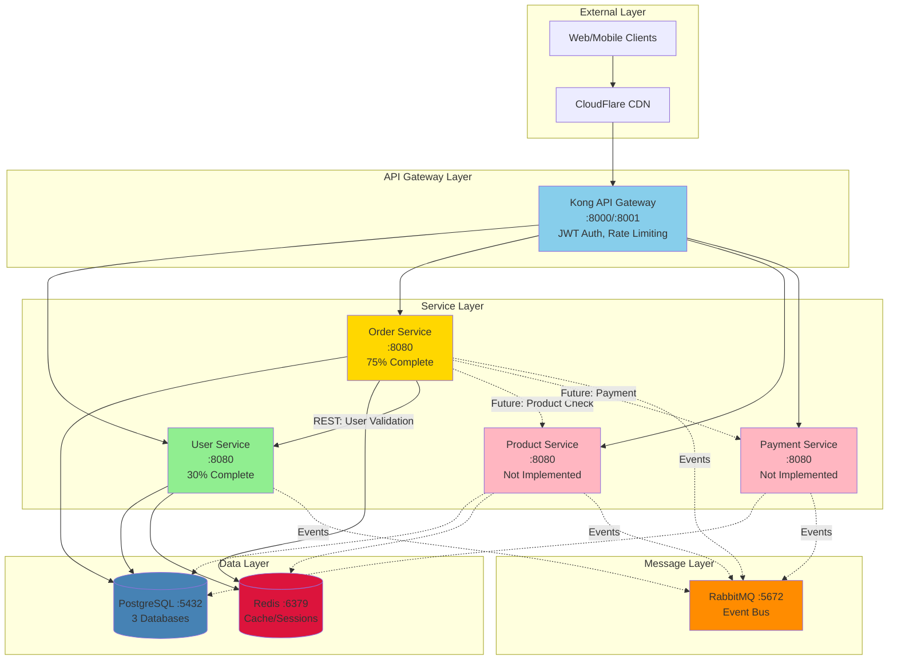
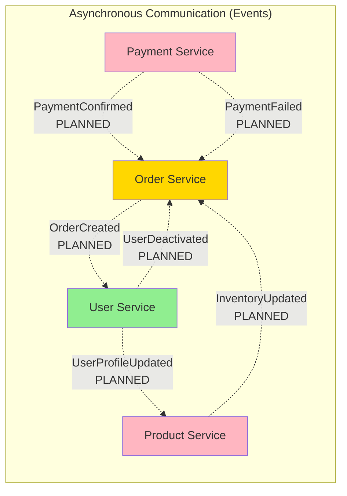
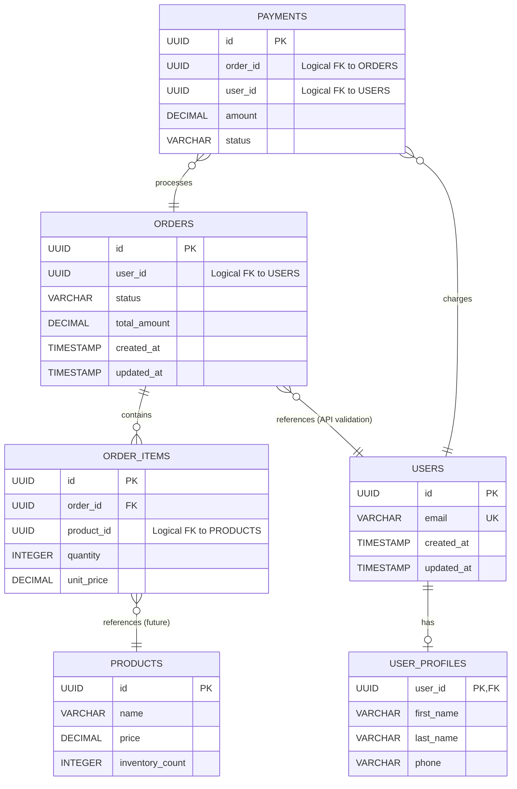
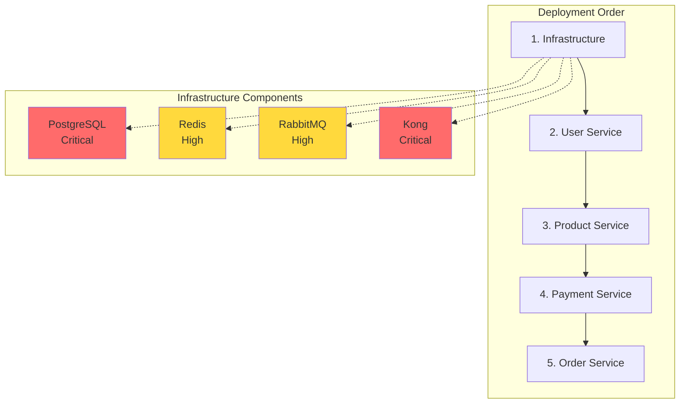
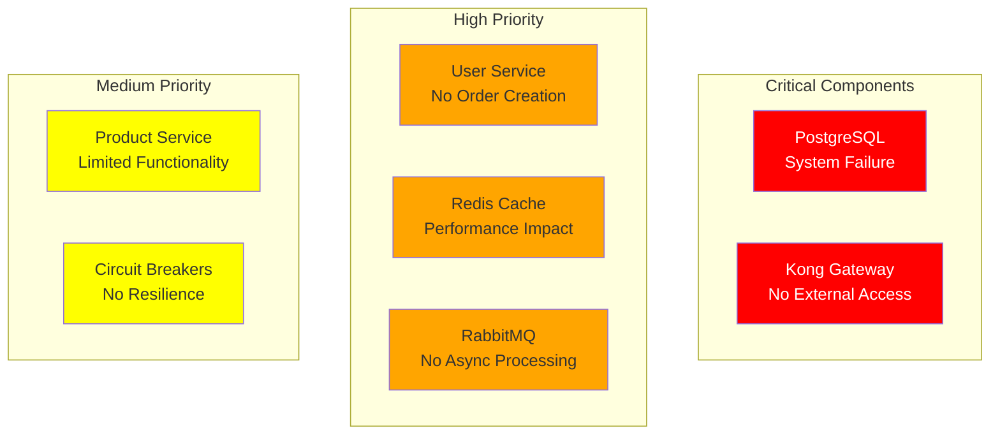
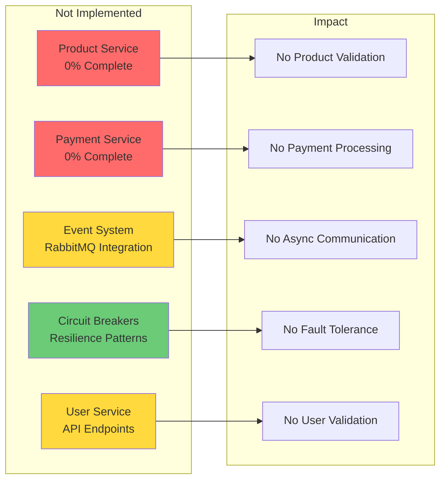
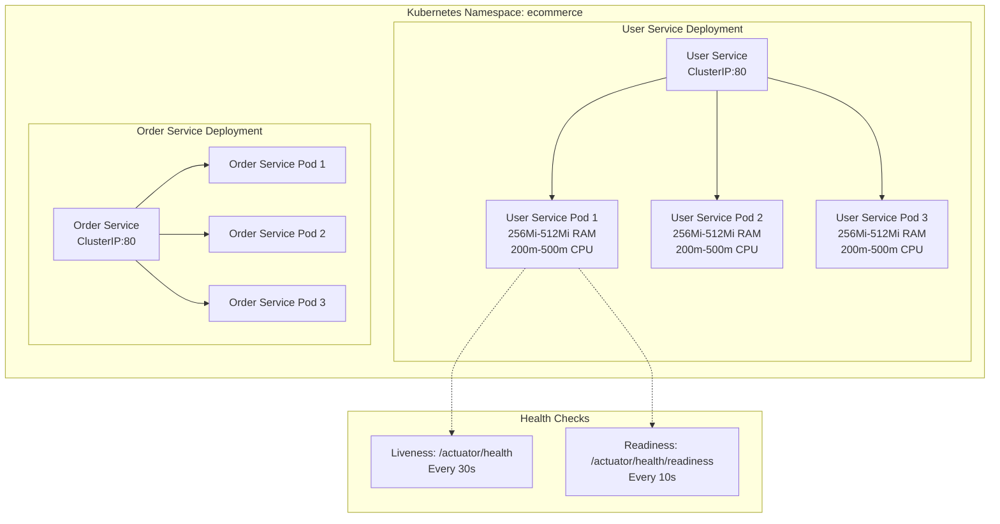
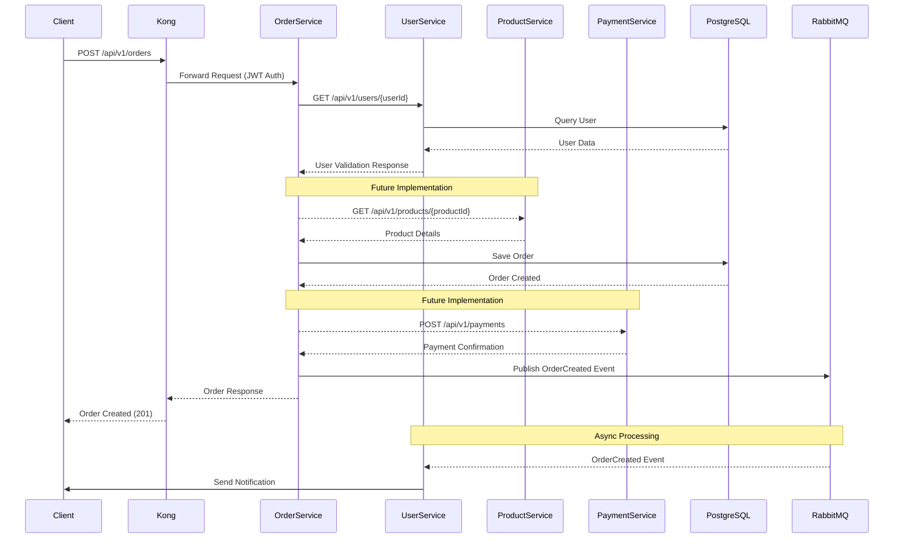

# E-Commerce Platform Dependency Visualization

## High-Level Architecture Overview



## Service Communication Patterns

```mermaid
graph LR
    subgraph "Synchronous Communication (REST)"
        OS1[Order Service]
        US1[User Service]
        PS1[Product Service]
        PAS1[Payment Service]
        
        OS1 -->|GET /api/v1/users/{id}<br/>User Validation| US1
        OS1 -.->|GET /api/v1/products/{id}<br/>Product Details<br/>PLANNED| PS1
        OS1 -.->|POST /api/v1/payments<br/>Process Payment<br/>PLANNED| PAS1
        PAS1 -.->|GET /api/v1/users/{id}<br/>Account Verify<br/>PLANNED| US1
    end
    
    style OS1 fill:#FFD700
    style US1 fill:#90EE90
    style PS1 fill:#FFB6C1
    style PAS1 fill:#FFB6C1
```



## Database Dependencies



## Deployment Dependencies



## Criticality Analysis



## Missing Implementations



## Kubernetes Deployment Architecture



## Data Flow Diagram



## Legend

- 🟢 Green: Implemented and functional
- 🟡 Yellow: Partially implemented
- 🔴 Red: Not implemented / Critical component
- Solid Lines: Implemented dependencies
- Dotted Lines: Planned dependencies